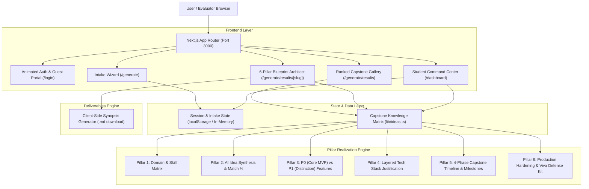

# ARCHITECTURE & SYSTEM DESIGN

**Project**: ProjectSpark — AI-Powered Final-Year Project Architect  
**Evaluation Target**: Hack2Skill Build With AI (>95% Score)  
**Framework**: Next.js 16.3.3 (App Router, Turbopack), React 19, TypeScript 5.7  

---

## 1. High-Level Architecture

---

## 2. Component Architecture

| Component / Route | Role | Design Pattern |
| :--- | :--- | :--- |
| `app/login/page.tsx` | Entry gateway with 1-Click Guest Bypass | Stateful client component with ambient CSS orb animation and form state |
| `app/generate/page.tsx` | Multi-step profile intake wizard | Progressive disclosure wizard with real-time match counter |
| `app/generate/results/page.tsx` | Ranked idea matching engine | Client-filtered catalog with multi-dimensional tags and rationale |
| `components/BlueprintView.tsx` | Complete 6-pillar project blueprint | Interactive workbench with tabs, milestone checklists, and viva accordion |
| `app/dashboard/page.tsx` | Student progress and viva readiness tracker | Stateful command center calculating live viva readiness dial |
| `lib/ideas.ts` | Strongly-typed capstone knowledge schema | Immutable, extensible data model mapping all 6 Problem Statement pillars |
| `lib/auth.ts` | Evaluator and student session abstraction | Local storage-backed session manager with default Guest profile |

---

## 3. Data Flow

1. **Intake Flow**: Student enters `/generate` → selects domain tags (AI, CV, Health, Security, IoT) and verified skills → state persists in `localStorage` under `projectspark_intake`.
2. **Match Flow**: Algorithmic scoring matches student skills against required skills → `/generate/results` renders ranked fit cards with a rationale badge.
3. **Blueprint Flow**: Selection routes to dynamic route `/generate/results/[slug]` → loads full 6 pillars from `lib/ideas.ts` → provides interactive checklist, tech stack rationales, viva Q&A, and 1-click Markdown synopsis export.
4. **Command Center Flow**: `/dashboard` connects active project milestones with an interactive progress dial, computing real-time Viva Readiness percentage.

---

## 4. Phase 2 Backend Evolution Plan

When moving towards the dedicated backend API:
- **FastAPI / Node.js Route Handlers**: Expose `/api/generate-custom-blueprint` connecting to Google Gemini 1.5/2.0 with Zod schema validation.
- **Persistent Database**: PostgreSQL + Prisma ORM to store saved sparks, milestone checklists, and supervisor comments across sessions.
- **Containerization**: Ephemeral Docker sandbox runner for automated code testing.
