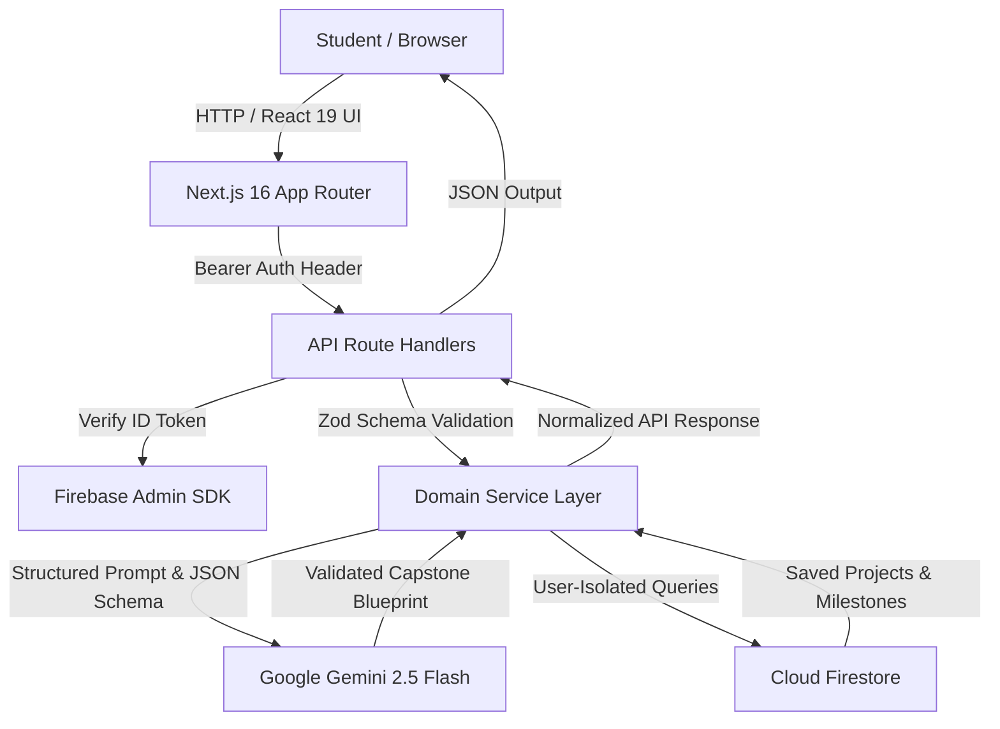

# ProjectSpark — AI-Powered Final-Year Project Architect

> **An intelligent capstone architect transforming student skills and domain passions into practical, defensible, production-grade engineering projects.**

[](https://nextjs.org/)
[](https://react.dev/)
[](https://www.typescriptlang.org/)
[](https://tailwindcss.com/)
[](https://vitest.dev/)

---

## 🎯 Problem Statement
> *"build an AI powered platform that helps final-year students to generate project ideas based on their interests and skills that provide guidance on features, technologies, development steps, and improvements to turn the idea into a practical project."*

---

## 🏛 System Architecture & Data Flow



---

## ✨ Key Capabilities

1. **Interactive Capstone Profile Intake (`/generate`)**:
   - Captures domain interests (AI, Computer Vision, Healthcare, Cybersecurity, IoT, DevTools).
   - Categorized skills breakdown (Languages, Frameworks, Backend, AI runtimes).
   - Practical constraints: Timeline (4-6 weeks to 1 year) and Team scope.
2. **AI-Powered Tailored Ideas Engine (`/generate/results`)**:
   - Structured multi-project generation via Google Gemini 2.5 Flash (`@google/genai`).
   - Algorithmic matching with transparent "Why this matches you" technical rationale.
3. **Capstone Blueprint Architect (`/generate/results/[slug]`)**:
   - **Features Guidance**: Toggle between Core MVP (P0) and Distinction (P1) features.
   - **Technologies Guidance**: Explicit architectural justifications for every layer (UI, API, AI, Database).
   - **Development Steps**: 4-Phase capstone milestone roadmap aligned with university project reviews.
   - **Practical Improvements**: Hardening suggestions & real-time Gemini AI refinement assistant.
   - **Viva Defense Kit**: Curated examiner questions, technical model answers, and defense strategies.
   - **📥 1-Click Capstone Synopsis (.md)**: Exports formatted, university-ready markdown documentation.
4. **Student Command Center (`/dashboard`)**:
   - Live **Academic Defense Readiness Dial** dynamically calculated from checked deliverables.
   - Real-time milestone tracker and saved capstone portfolio.

---

## 🛠 Tech Stack

- **Framework**: Next.js 16 (App Router, Turbopack)
- **Frontend**: React 19, Tailwind CSS v4, Lucide React
- **AI Core**: Google Gemini 2.5 Flash (`@google/genai`)
- **Backend & Auth**: Next.js API Route Handlers, Firebase Auth, Cloud Firestore
- **Type Safety**: TypeScript Strict Mode, Zod v4 schemas
- **Testing**: Vitest v5 with v8 code coverage reporting

---

## 🚀 Quick Start (Local Setup)

```powershell
# 1. Clone the repository and install dependencies
npm install

# 2. Configure environment variables
cp .env.example .env.local
# Add your GEMINI_API_KEY and Firebase credentials to .env.local

# 3. Run development server
npm run dev

# 4. Open in browser
# http://localhost:3000
```

### Production Verification Commands

```powershell
# Run TypeScript Typecheck
npx tsc --noEmit

# Run ESLint Linting
npm run lint

# Run Vitest Automated Test Suite with Coverage
npm run test:coverage

# Run Production Standalone Build
npm run build
```

---

## 🐳 Docker & Cloud Run Deployment

```powershell
# Build multi-stage production container
docker build -t projectspark-app .

# Run container locally
docker run -p 8080:8080 --env-file .env.local projectspark-app
```
